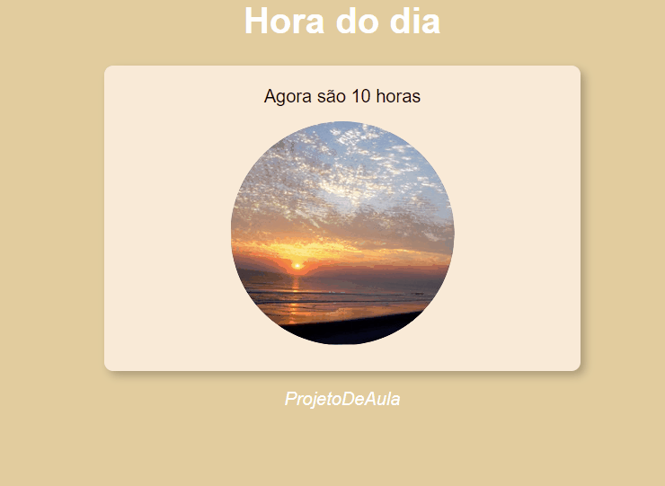

<h1 align="center">Hora do Dia</h1>

Este pequeno projeto foi feito para ter uma informação importante do dia a dia de uma forma mais visual e agradável.

## Índice

- [Visão Geral](#visão-geral)
- [Funcionalidades](#funcionalidades)
- [Demo](#demo)
- [Contato](#contato)

## Visão Geral

A aparência do site muda conforme a hora do dia, isso agrega na compreensão do usuário, pois o tema, imagens e outros aríficios mudará caso esteja em outro tempo do dia, como tarde e noite. O projeto mostra somente a hora, então não é um relógio. Só dá uma perspectiva de que horário do dia está.

## Funcionalidades

- Mostra a hora do dia em tempo real;
- Caso esteja de manhã, tarde ou noite, mudará o tema e imagem visualizada para melhor experiência;
- A aparência do site muda conforme a hora do dia;

## Demo

[Link para a demonstração do projeto](https://bruno-nog.github.io/hora-do-dia/)

## Contato

